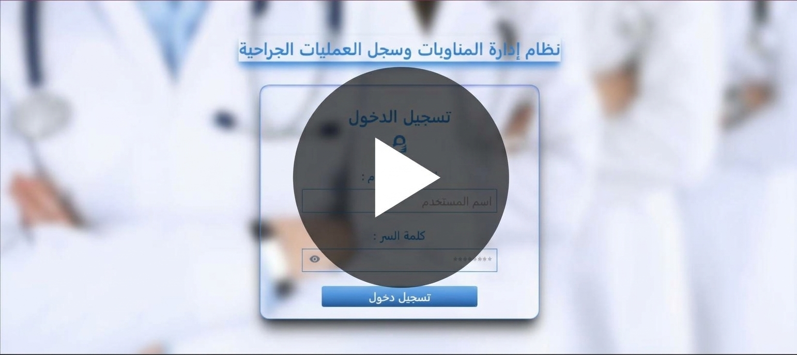

# Hospital Management & Digital Operations System

A modern web-based healthcare management solution designed to digitize and streamline essential hospital administrative operations.

The system provides centralized tools for managing medical staff shifts, surgical operation records, user access, permissions, backups, and operational data through a secure and intuitive interface.

It is designed as a customizable solution that can be adapted to the operational requirements of hospitals, medical centers, and healthcare organizations.

## Core Features

### Medical Staff Shift Management

- Create, edit, delete, and view staff shifts.
- Organize shifts by doctor, study year, department, location, and date.
- Calendar-based visualization for easier schedule management.
- Support for different shift locations and working periods.

### Automated Shift Scheduling

- Generate shift schedules automatically based on predefined requirements.
- Support scheduling constraints and distribution rules.
- Organize doctors according to their study years and assigned locations.

### Surgical Operations Management

- Digitally manage and archive surgical operation records.
- Store essential operation and patient-related information in a centralized system.
- Search and manage operation records efficiently.
- Export operational data into professional documents.

### User Management

- Create, edit, and manage system users.
- Organize users according to their roles and departments.
- Support different levels of access within the system.

### Role-Based Access Control

- Manage permissions according to user roles.
- Control access to system modules and operations.
- Provide different interfaces and capabilities for administrators, department managers, and doctors.

### Administrative Dashboard

- Centralized overview of important operational information.
- Display key statistics and system activity.
- Provide quick access to major administrative functions.

### Data Import & Export

- Import structured data from Excel files.
- Export selected information for reporting and administrative use.
- Support document generation for operational records.

### Backup & Data Management

- Manage system backups.
- Support administrative data protection and recovery workflows.

### Centralized Data Access

- Search and access operational records through a unified interface.
- Reduce dependency on paper-based records.
- Improve the organization and accessibility of hospital information.

## User Roles & Access

The system provides role-based interfaces and permissions to support different levels of responsibility within a healthcare organization.

### General Administrator

Responsible for managing the overall system and administrative operations.

- Manage system users.
- Manage roles and permissions.
- Monitor operational information through the dashboard.
- Manage shifts and surgical operation records.
- Manage backups and administrative data.

### Department Manager

Responsible for managing operations within the assigned department.

- Manage department-related shifts.
- View and organize medical staff schedules.
- Access permitted operational modules.
- Manage information according to assigned permissions.

### Doctor

Provides doctors with access to the functions assigned to their role.

- View assigned shifts.
- Access authorized operational information.
- Use the system according to the permissions granted by administrators.

## Technologies & Architecture

### Frontend

The frontend is built as a modern single-page application using:

- React 19
- Vite
- Tailwind CSS
- React Router
- Axios for API communication
- FullCalendar for shift scheduling and calendar visualization
- Handsontable for structured and bulk data entry
- Framer Motion for interface animations
- Recharts for data visualization
- Headless UI
- React Select
- Lucide React & React Icons

### Backend

The backend is developed using:

- PHP 8.2+
- Laravel 11
- Laravel Sanctum for authentication
- Spatie Laravel Permission for role and permission management
- Maatwebsite Excel for Excel data processing
- DOMPDF & mPDF for PDF generation
- PHPWord for Word document generation

### Database

- SQLite for the current application configuration.

### Architecture

The system follows a separated frontend/backend architecture:

```text
React Frontend
      |
      | REST API
      v
Laravel Backend
      |
      v
Database

## Project Structure

The project is organized into separate frontend and backend applications:

```text
hospital-management-system/
|
├── MyProject/              # Laravel Backend
│   ├── app/
│   ├── database/
│   ├── routes/
│   ├── resources/
│   └── ...
│
├── my_project/             # React Frontend
│   ├── src/
│   │   ├── pages/
│   │   ├── components/
│   │   └── ...
│   ├── public/
│   └── ...
│
├── .gitignore
└── README.md

## Installation & Setup

### Prerequisites

Make sure the following tools are installed on your system:

- PHP 8.2 or later
- Composer
- Node.js and npm
- Git

### 1. Clone the Repository

```bash
git clone https://github.com/JakyNassar/homs-university-hospital-system.git
cd homs-university-hospital-system

### 2. Backend Setup

Navigate to the Laravel backend:

```bash
cd MyProject

Install PHP dependencies:

```bash
composer install

Create the environment file:

```bash
copy .env.example .env

Generate the Laravel application key:

```bash
php artisan key:generate
Configure the database connection in the `.env` file.

For the current application configuration:

```env
DB_CONNECTION=sqlite

Run the database migrations:

```bash
php artisan migrate

Start the Laravel development server:

```bash
php artisan serve

. Frontend Setup
cd my_project
npm install
npm run dev

4. Application

Once both servers are running, the frontend can communicate with the Laravel backend through the configured API.

Security & Access Control

The system includes security and access-control mechanisms designed to protect administrative operations and restrict access according to user roles and permissions.

Key security features include:

Authentication using Laravel Sanctum.
Role-based access control.
Granular permissions for system modules and operations.
Protected administrative functionality.
Environment-based configuration for sensitive application settings.
Sensitive environment files are excluded from version control.

Screenshots & Demo

The system provides a modern and intuitive interface for managing hospital administrative operations.

Dashboard

The administrative dashboard provides an overview of key operational information and quick access to the main system modules.

<!-- Add dashboard screenshot here -->
Shift Management

The shift management interface provides calendar-based scheduling and organization of medical staff shifts.

<!-- Add shift management screenshot here -->
Surgical Operations

The surgical operations module provides centralized management and digital archiving of surgical records.

<!-- Add surgical operations screenshot here -->
User & Permission Management

Administrators can manage users, roles, and permissions according to the organization's operational requirements.

<!-- Add user management screenshot here -->
Automated Scheduling

The automated scheduling module helps generate organized shift schedules according to predefined rules and constraints.

<!-- Add automated scheduling screenshot here -->

Business Value

The system is designed to help healthcare organizations move from fragmented and paper-based administrative workflows to a centralized digital environment.

It can help organizations:

Reduce reliance on paper-based records.
Improve the organization and accessibility of operational data.
Simplify medical staff shift management.
Reduce manual effort in schedule preparation.
Centralize surgical operation records.
Improve administrative control through role-based access.
Provide a unified platform for daily operational activities.
Support more efficient data management and reporting.
Custom Solutions

The system can be customized and extended according to the operational requirements of hospitals, medical centers, and healthcare organizations.

Potential customization areas include:

Additional departments and organizational structures.
Custom user roles and permission levels.
Additional administrative modules.
Customized reports and document formats.
Integration with existing systems and APIs.
Additional workflow and scheduling requirements.
Interface customization according to the organization's branding.
Request a Customized Solution

Organizations interested in adapting the system to their specific operational requirements can request a customized implementation or additional features.


## 🎥 Project Demo

## 🎥 Project Demo

[](https://drive.google.com/file/d/17hVkBBZYF-r_IRFnBtRm4_FXkCj2tkEe/view?usp=sharing)
